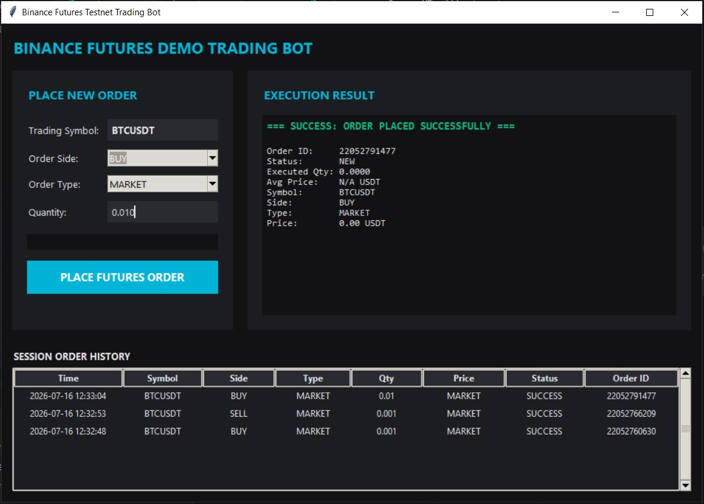

# Binance Futures Testnet Trading Bot

A modular desktop and command-line client for placing MARKET and LIMIT orders on the Binance Futures Testnet (USDT-M) securely.

## Project Structure

```text
trading_bot/
  bot/
    __init__.py
    client.py         # REST client with HMAC-SHA256 signing and server time sync
    orders.py         # Order placement wrapper
    validators.py     # Pre-flight input validators
    logging_config.py # Rotating logs with automatic credential redaction
  cli.py              # CLI entry point
  gui.py              # Desktop GUI entry point
  tests/              # Unit test suite
  requirements.txt    # Project dependencies
  .env.example        # Environment configuration template
```

## Setup Instructions

### 1. Installation
Clone the repository, configure a virtual environment, and install the required libraries:

```bash
python -m venv .venv
source .venv/bin/activate  # On Windows use: .venv\Scripts\activate.bat
pip install -r requirements.txt
```

### 2. Configure API Credentials
Create a `.env` file in the root directory based on `.env.example`:

```env
BINANCE_API_KEY=your_futures_testnet_api_key
BINANCE_API_SECRET=your_futures_testnet_api_secret
```

*Note: All trade activities are routed to the Binance Futures Testnet server. Credentials and request signatures are automatically redacted from all log files.*

## Usage

### Command Line Interface (CLI)
Run the CLI using python:

```bash
# View help and available options
python cli.py --help

# Place a MARKET BUY order
python cli.py --symbol BTCUSDT --side BUY --type MARKET --quantity 0.001

# Place a LIMIT SELL order
python cli.py --symbol BTCUSDT --side SELL --type LIMIT --quantity 0.001 --price 95000
```

### Desktop GUI
Launch the local desktop interface:

```bash
python gui.py
```

#### GUI Screenshot
[//]: # (Placeholder for your GUI screenshot. Replace the path below with your image file)


## Testing
Run the automated test suite using pytest to verify validations and order construction:

```bash
python -m pytest
```

## Logs
Logs are saved in the `logs/trading_bot.log` file. The logger rotates files at 5MB, keeps up to three backups, and redacts all instances of API keys, secrets, and signatures from the logs.
